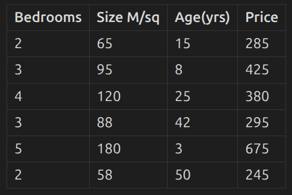
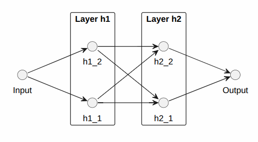

PyTorch is the most popular machine learning framework.

Install it through "pip install torch" in any CLI and import pytorch in your program using "import torch".

Machine Learning is all about numbers, their manipulation and usage in different places and forms. Before that, we should be able to store those numbers somewhere.

A variable that stores values in machine learning programs is called a 'Tensor'.

An array is a list or collection of similar elements with the abilities to perform basic operations on those numbers.
On the other hand, a tensor is an array but with even more extra abilities and power over the numbers, only to be used in machine learning.

# A SAMPLE TENSOR:-
[0.26, 0.21, 0.39, 0.07, 0.12, 0.42]

# TENSOR OPERATIONS:-
1. torch.add() -> adds tensors of same dimensions
2. torch.sub() -> subtracts tensors of same dims
3. torch.div() -> divides tensors of same dims
4. torch.mul() -> multiplies same dims
...and so on...

# NOW LET'S CONVERT A REAL DATA INTO A TENSOR

We have this simple table which is comprised of 4 labelled columns.
 


Remove the header, convert this data into a tensor like this:-
```
>>> houses = torch.tensor([
... [2, 65, 15, 285],
... [3, 95, 8, 425,],
... [4, 120, 25, 380],
... [3, 88, 42, 295],
... [5, 180, 3, 675],
... [2, 58, 50, 245],
... ], dtype=torch.float32)
```

Now what we will do is, use the first three columns(features of the house) and predict the price(4th column) for each row.
So make two new tensors acquired from "houses" variable, named "features" and "targets".

```
>>> features = torch.tensor([
... [2, 65, 15],
... [3, 95, 8],
... [4, 120, 25],
... [3, 88, 42],
... [5, 180, 3],
... [2, 58, 50],
... ], dtype=torch.float32)
```
and
```
>>> targets = torch.tensor([
... [285],
... [425],
... [380],
... [295],
... [675],
... [245],
... ], dtype=torch.float32)
```

# NEURAL NETWORKS:-
In ML, there is something called as a "neural network". There can be many neurons inside it which is basically dependent upon the type of architecture. It takes an input(or inputs), performs some operations on it, and returns an output to us.

This is a simple neural network with input node, two hidden layers, and an output node:-


Let's go a bit deeper into one singular node inside a layer(either h1 or h2) to see what happens there:-
1. Each node has something called a "weight" and a "bias" defined already in the starting. For example "h1_1" can be:-
weights = [0.11, 0.12, -0.25]
bias = 0.75
2. When the input arrives, each element of the input is multiplied with the weights:-
-> (2 * 0.11) + (65 * 0.12) + (15 * -0.25) = 4.27
and the bias is added to the result:-
-> 4.27 + 0.75 = 5.02

This is called a "Linear Transformation" and in PyTorch it's handled by "torch.nn.Linear()", the output is then passed forward.

Next here are "Non-Linear Transformations" that are called "Activation functions" in PyTorch:-
1. relu(x) -> converts negative numbers to 0, keeps positive same
2. sigmoid(x) -> converts any number into a range between 0 and 1
3. tanh(x) -> converts any number into a range between -1 and 1(its zero-centered)
...and so on...

The output we got from "nn.Linear" will be fed to relu(5.02).

After travelling through the entire network once, we reach the output. The newly acquird output will be compared to the target data and if it isn't matching, we use "nn.MSELoss()" and calculate the loss value, from there we travel back to the first hidden layer. 

Quick look into MSELoss -> It calculates the "mean squared error" loss. Process -> difference between the prediction and target, square them and find the mean(average)
```
import torch
import torch.nn as nn
target = torch.tensor([100, 200, 300, 400, 500], dtype=torch.float32)
prediction = torch.tensor([101, 198, 303, 396, 505], dtype=torch.float32)
loss = criterion(prediction, target)
print(loss)
>>> tensor(11.)
```
This is what MSELoss() actually does inside:-
```
(((100-101)**2)+((200-198)**2)+((300-303)**2)+((400-396)**2)+((500-505)**2))/5
>>> 11.0
```

Once we calculate the loss, we update the weights, this process of "learn and update" is called "Backpropagation" and PyTorch supports this through "backward()" function.

In backpropagation process, something called "gradients" are calculated, they are basically hints/guides for "how much to nudge the weights to match the target-value the next time", then there's something called an "optimizer" that actually does the job of updating the weights.

Now we will use whatever we learnt about PyTorch to use the input(features) and predict the output(targets/price).

# IMPLEMENTATION
```
import torch
import torch.nn as nn
import torch.optim as optim

# Our house data as we discussed above has been included here as "features" and "targets"
features = torch.tensor([
    [2, 65, 15],
    [3, 95, 8],
    [4, 120, 25],
    [3, 88, 42],
    [5, 180, 3],
    [2, 58, 50],
], dtype=torch.float32)

targets = torch.tensor([
    [285],
    [425],
    [380],
    [295],
    [675],
    [245],
], dtype=torch.float32)

# This is the actual "Neural Network" we saw in the diagram
class HousePricePredictor(nn.Module): # "HousePricePredictor" inherits properties from "nn.Module"
    def __init__(self):
        super().__init__() # this thing just connects "HousePricePredictor" and "nn.Module" properly or else we would get some errors
        # This is how "Linear Transformation" is being taken care by "nn.Linear".
        # Layerd and nodes are being formed from the transformations
        self.linear1 = nn.Linear(3, 6)   # 3 inputs -> 6 hidden neurons (1st hidden layer)
        self.linear2 = nn.Linear(6, 4)   # 6 hidden -> 4 hidden neurons (2nd hidden layer)
        self.linear3 = nn.Linear(4, 1)   # 4 hidden -> 1 output (price)
        self.relu = nn.ReLU() # The non-Linear transformation to do in the last before moving to next node
    
    def forward(self, x): # After building the network, this is the button we will press so it "starts working"
        """
        x is the "features" tensor getting passed here, it gets linearly transformed, then non-linearly in the first layer
        2nd layer is where it gets linear/non-linearly transformed again
        3rd layer is where the linear transformation generates the output
        """
        x = self.relu(self.linear1(x))   # Linear first then non-linear transformation (1st hidden layer)
        x = self.relu(self.linear2(x))   # Linear first then non-linear transformation (2nd hidden layer)
        x = self.linear3(x)              # Final linear transformation layer (output)
        # note : non-linearly transforming right before the output would exclude necessary negative numbers so we dont do it in the last
        return x # this is sending the transformed "features" back to the model

# Create model, loss function, optimizer
model = HousePricePredictor()                       # creating model constructor
criterion = nn.MSELoss()                            # create the loss object instead of using MSELoss directly or else you would face errors
optimizer = optim.Adam(model.parameters(), lr=0.01) # "Adam" = optimizer name. "model.parameters" = calls all weights/biases here. lr = rate of update

# Training loop
print("Training started...")
for epoch in range(1000): # You can increase/decrease this if you aint getting lower losses after running the program
    # Forward pass or "getting experience"
    predictions = model(features) # "features" is getting passed to "forward function" inside the model class
    loss = criterion(predictions, targets) # Performing "MSELoss" to get the loss value of this iteration
    
    # Backward pass or "learning from experience"
    optimizer.zero_grad() # empty the previous gradients to not mess up current updation and save memory
    loss.backward() # this is what pushes the button for "backpropagation" and we through the computation graph from output to the first hidden layer
    optimizer.step() # this is what actually "updates the weights" based upon the loss value which was calculated earlier
    
    # Print progress every 100 epochs to see how the loss value goes down
    if (epoch + 1) % 100 == 0:
        print(f"Epoch {epoch+1}: Loss = {loss.item():.4f}")

# Post-training/Inference/
print("\nFinal Predictions:")
with torch.no_grad(): # no need to track gradients -> a) we are no more training. we are testing. b) save memory
    final_predictions = model(features)
    for i, (pred, actual) in enumerate(zip(final_predictions, targets)):
    # pair the actual prediction and target together, index them with enumerate
        print(f"House {i+1}: Predicted ${pred.item():.0f}k, Actual ${actual.item():.0f}k")
```

DONE!

We will do multiple experiments and see now the results
.
(suggested : when we update epochs, update the condition for "print epoch" to as many lines as you need. suggested 5-10)

a. Now time to check results from the first run:-
```
Training started...
Epoch 100: Loss = 2805.7588
Epoch 200: Loss = 2157.8174
Epoch 300: Loss = 2137.9529
Epoch 400: Loss = 2117.0271
Epoch 500: Loss = 2093.1426
Epoch 600: Loss = 2066.5312
Epoch 700: Loss = 2037.3112
Epoch 800: Loss = 2005.4912
Epoch 900: Loss = 1970.9883
Epoch 1000: Loss = 1933.6045

Final Predictions:
House 1: Predicted $250k, Actual $285k
House 2: Predicted $363k, Actual $425k
House 3: Predicted $447k, Actual $380k
House 4: Predicted $322k, Actual $295k
House 5: Predicted $675k, Actual $675k
House 6: Predicted $209k, Actual $245k
```

We can see the loss is very high and the prediction isn't too accurate in most cases if we confirm above. 
So we will manually nudge, either the learning rate, or epochs. Learning rate is a sensitive value so first let's increase the number of epochs to see if loss goes down or not.

b. Epoch 1000 -> Epoch 5000 
```
Training started...
Epoch 500: Loss = 164384.6719
Epoch 1000: Loss = 160648.5625
Epoch 1500: Loss = 156978.3281
Epoch 2000: Loss = 153370.1875
Epoch 2500: Loss = 149820.8594
Epoch 3000: Loss = 146327.7656
Epoch 3500: Loss = 142888.8281
Epoch 4000: Loss = 139502.3906
Epoch 4500: Loss = 136167.3906
Epoch 5000: Loss = 132882.7969

Final Predictions:
House 1: Predicted $49k, Actual $285k
House 2: Predicted $49k, Actual $425k
House 3: Predicted $49k, Actual $380k
House 4: Predicted $49k, Actual $295k
House 5: Predicted $49k, Actual $675k
House 6: Predicted $49k, Actual $245k
```
This result is somehow even worse. Let's increase it to 10000 and see.

c. Epoch 5000 -> Epoch 10000
```
Training started...
Epoch 1000: Loss = 1972.3585
Epoch 2000: Loss = 1722.0690
Epoch 3000: Loss = 1241.5984
Epoch 4000: Loss = 714.9228
Epoch 5000: Loss = 516.2408
Epoch 6000: Loss = 497.9503
Epoch 7000: Loss = 497.9272
Epoch 8000: Loss = 497.9265
Epoch 9000: Loss = 497.9273
Epoch 10000: Loss = 497.9408

Final Predictions:
House 1: Predicted $317k, Actual $285k
House 2: Predicted $387k, Actual $425k
House 3: Predicted $395k, Actual $380k
House 4: Predicted $300k, Actual $295k
House 5: Predicted $674k, Actual $675k
House 6: Predicted $228k, Actual $245k
```
Somewhat better, the last 4 predictions are very close overall. Now let's change the learning rate a bit and see what happens to the loss.

d. lr 0.01 -> lr 0.01
```
Training started...
Epoch 1000: Loss = 3518.3184
Epoch 2000: Loss = 2183.2451
Epoch 3000: Loss = 2141.0630
Epoch 4000: Loss = 2096.1277
Epoch 5000: Loss = 2035.8463
Epoch 6000: Loss = 1957.1802
Epoch 7000: Loss = 1844.5704
Epoch 8000: Loss = 1612.7113
Epoch 9000: Loss = 378.1443
Epoch 10000: Loss = 67.8823

Final Predictions:
House 1: Predicted $295k, Actual $285k
House 2: Predicted $408k, Actual $425k
House 3: Predicted $379k, Actual $380k
House 4: Predicted $295k, Actual $295k
House 5: Predicted $681k, Actual $675k
House 6: Predicted $245k, Actual $245k
```
SO CLOSE........

Now let's increase the epoch just a tiny bit

e. Epoch 10000 -> 10500
```
Training started...
Epoch 1000: Loss = 2701.0085
Epoch 2000: Loss = 2013.0194
Epoch 3000: Loss = 1850.9360
Epoch 4000: Loss = 1628.0519
Epoch 5000: Loss = 1421.8170
Epoch 6000: Loss = 1215.7957
Epoch 7000: Loss = 863.5825
Epoch 8000: Loss = 246.8218
Epoch 9000: Loss = 7.2110
Epoch 10000: Loss = 0.7017

Final Predictions:
House 1: Predicted $286k, Actual $285k
House 2: Predicted $424k, Actual $425k
House 3: Predicted $380k, Actual $380k
House 4: Predicted $295k, Actual $295k
House 5: Predicted $675k, Actual $675k
House 6: Predicted $245k, Actual $245k
```
YAYY!!...We are done in just 5 experiments!

We trained a small neural network from scratch and it works too.

I can explain the difference between updating epochs and updating lr in this manner:-
1. updating epochs means the programs runs longer and has more time to learn with whatever learning intensity already set
2. updating lr means the program learns with more/less intensely in each move with whatever learning time already set

Thanks a lot for reading!
