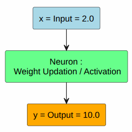
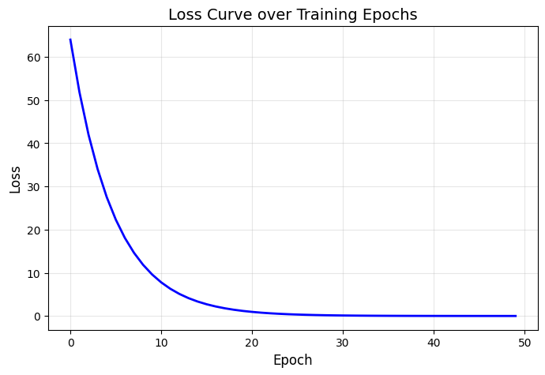

We will learn backprop by skimming through what we already know about tensors in PyTorch.

```
# these are two sample tensors in upon which we can perform operations.
# they are advanced form of arrays with some extra powers with them.

input = torch.tensor(2.0)
target = torch.tensor(10.0)
weight = torch.tensor(1.0, requires_grad=True)
# then there's something called a 'bias' alongside weight too
```

Now imagine we have a single neuron in a neural network.



Let's see how this works, by pressing a button called.....

# "FORWARD PASS"
```
Input to the network -> Node performs some activity(weight's involved -> Output observed -> Loss calculated
```

Representing it mathematically :-

```
x -> w -> y -> L

```

Here, 
```
1. z = (w * x) + b
# This is called a "Linear Transformation" that our input goes through.

2. y = σ(z)
# This is called a "Non-Linear Transformation" that gives the output. 
# Also, this weird symbol "σ" will be explained don't worry ;)

# The above two steps happens inside the neuron, now we are outside

3. L = (y - t)^2     
# Loss = (output - target)^2
# Discussed in a bit detail in the "Calculating Loss" section
   
```


## LINEAR TRANSFORMATION

The input(s) passed inside the neuron are multiplied with the weights, then the bias is added to the result, let's just call it "z".

```
z = (w * x) + b
```

## NON-LINEAR TRANSFORMATION

In the same neuron, 'z' is passed through something called an "Activation Function", which does the non-linear transformation, the result of that operation is the "output(y)" we need from this particular forward pass.

```
y = σ(z)

# Now, as for this symbol "σ", which is called "sigma", in this case it's a placeholder for "non-linear transformation".
```

OPTIONAL READ(on the symbol):-

a. There are many types of it, but "σ" is used to denote the few specific activation functions that are responsible for carrying out "non-linear transformation", eg "sigmoid", "relu" and "tanh" functions. Other types are denoted by other symbols.

b. For those who were confused from the symbol, it was just used as a placeholder instead of writing tanh, relu etc, as "σ" represents them all. While programming, we type "ReLU" and "tanh" to use those activation functions. Once you get used to them, you won't rely much on symbols, but it's suggested that you be aware of them to be able to identity them in research papers and search them better :)

## CALCULATING LOSS

There are many kind of problems that Machine Learning solves, the very specific one we are working on is called "regression", forget the meaning for now, just remember there are types and this one is called "regression". It calculates loss by using something called "MSELoss(mean squared error)". It works when there are multiple samples, but in our case, we are just becoming familiar with backpropagation, and we don't have multiple samples in our input and output either, so "MSELoss" formula isn't required here yay!

We will be using a smaller loss-calculating formula which we used in the "Forward Pass" section:-
```
Loss = (output - target)^2
```

"output - target" makes total sense as "how much loss did I face from this operation?" in a general sense, but why are we squaring it?

1. To convert the negative loss values to positive as "as close to zero as possible" is what we want but negative loss will be "better than perfect" so that will lead to some other complicacies, so we are getting rid of that.
2. The positive error will get squared and become a massive error(eg 3 -> 9). This pushes our model to avoid large errors and overcorrect it by updating weights better(the learning part from "backpropagation")

## COMPUTATIONAL GRAPH

While the forward pass was running, simultaneously our model was preparing this computation graph which we can't see:-
```
x -> (*W) -> (+b) -> z -> (σ) -> y -> L(loss)
```

It has "tracked" all the "computations" that has happened under the hood and kept in this format, to be able to "travel back" through it comfortably in the next phase.

```
FORWARD PASS ENDS HERE. BACKPROP STARTS BELOW.
```
## CHAIN RULE

This is the most important and repeated formula from calculus that's the core of backpropagation.

**CHAIN RULE FORMULA:-**
```
dL/dw = (dL/dy) * (dy/dz) * (dz/dw)

# dont worry. read and understand this part carefully. after understanding, in the last there is a mini-version you just need to remember not this whole thing
```

**MEANING:-**

1. dL/dw = "How LOSS changes with respect to WEIGHT"
2. dL/dy = "How LOSS changes with respect to OUTPUT"
3. dy/dz = "How OUTPUT changes with respect to Linear-Transformation"
4. dz/dw = "How Linear-Transformation changes with respect to weights"

Also called  "backward pass", after forward pass, this is the "button we press" to travel back from the output to the input of the neural network.

Success will be determined by whether the loss value is dropping or not.

"One forward pass -> One backward pass -> One Loss value" = one loop.

To actually perform a successful machine learning activity, we run this loop multiple times to get a series of loss values from high to low.

# APPLYING IT

The expressions and their derivatives:-
```
1. Loss part:        L = (y - t)^2
   Derivative :      dL/dy = 2(y - t)
   Reason :          Derivative of a^2 is 2a, where a = (y - t)
   
2. Linear Part :     z = wx + b
   Derivative :      dz/dw = x
   Reason :          it was "with respect to" w, so x. constant 'b' removed.
   
3. Non-Linear Part : y = σ(z) # lets take "RelU activation function here"
   Derivative :      dy/dz = 1, if z > 0, or else 0.
```

The values from the derivatives calculated above are called "Gradients" in Machine Learning.

Quick look at the flow:-
```
x -> z -> y -> L
```

During backward pass, each node here receives a gradient from right -> multiples it by it's own derivative -> sends left

(GO THROUGH THE ORIGINAL CHAIN RULE FORMULA AGAIN)

Good news!....you just need to calculate "dL/dw" for practice, not the entire chain rule for the full computation graph(because both gives the same results), computer will handle that ;)

## SLOPE

"dL/dw" is called "Slope of the loss curve with respect to weights", or just "Slope". If we plot the model's changing loss curves in a graph, we will see if it's going up or down, and the steepness of the curve is known as the slope.


(now backpropagation's main process is mathematically over)

## UPDATE RULE

```
w = w - lr(dL/dw)
```

This is where "learning" happens. After getting all the gradients from the computational graph, this formula "updates" all the weights to "try to" lower the loss in the next run loop.

Note -> There is something called an "optimizer" which fetches the weights, biases and "updates" them using the "update rule", but we are not relying on optimizers now. We will be doing it manually)

```
new_weight = old_weight - (learning_rate * slope)

# replace old/new "weight" with "bias" to update bias aswell.
```


# IMPLEMENTATION

```
import torch

# INPUT DATA & TARGET TO ACHIEVE
x = torch.tensor(2.0)
t = torch.tensor(10.0)

# Parameters
# PyTorch handles weights/biases on it's own, but here we do it manually
w = torch.tensor(1.0, requires_grad=True)
b = torch.tensor(0.0, requires_grad=True)
# "requires_grad=True" means it will track gradients

lr = 0.01
# "Learning Rate" decides how big/small of a leap the "Update Rule" takes

for epoch in range(50):
    # "Forward Pass" starts here
    z = w * x + b              # linear transformation
    y = torch.relu(z)          # non-linear (ReLU)
    loss = (y - t) ** 2        # Loss calculated

    # "Backward Pass/Backpropagation" happens through ".backward()"
    loss.backward()
    # here the tracked gradients decides the rate of update.
    # "training" for this loop over.

    # Update Rule
    with torch.no_grad(): # "torch.no_grad" turns off gradient tracking
        w -= lr * w.grad
        b -= lr * b.grad
        # the same formula applies to both weights and bias

    # This will empty the gradients before the next loop/epoch runs fresh
    w.grad.zero_()
    b.grad.zero_()

    # ---- PRINT PROGRESS/RESULT ----
    if (epoch+1) % 5 == 0:
        print(f"epoch {epoch+1:02d} | loss {loss.item():.4f} | y {y.item():.4f}")

print("--------------------")
print(f"Input given : {x.item():.4f} | Target given : {t.item():.4f}")
print(f"Final prediction : {y.item():.4f}")

```

We have seen how backpropagation works, time to see the results:-

```
epoch 05 | loss 27.5499 | y 4.7512
epoch 10 | loss 9.6061 | y 6.9006
epoch 15 | loss 3.3494 | y 8.1699
epoch 20 | loss 1.1679 | y 8.9193
epoch 25 | loss 0.4072 | y 9.3619
epoch 30 | loss 0.1420 | y 9.6232
epoch 35 | loss 0.0495 | y 9.7775
epoch 40 | loss 0.0173 | y 9.8686
epoch 45 | loss 0.0060 | y 9.9224
epoch 50 | loss 0.0021 | y 9.9542
--------------------
Input given : 2.0000 | Target given : 10.0000
Final prediction : 9.9542
```

Plotted loss curve:-(I didn't include plotting code in the implementation above)


1. Loss is close-to-perfect : 0.021
2. Prediction is close-to-perfect : 9.9542

Sweet. You can try with different epochs and learning rates to see how they change.

I hope this was a great help for you in understanding how backprop works in general. You should experiment with this and see where does it break and why.

Thanks a lot for reading!
