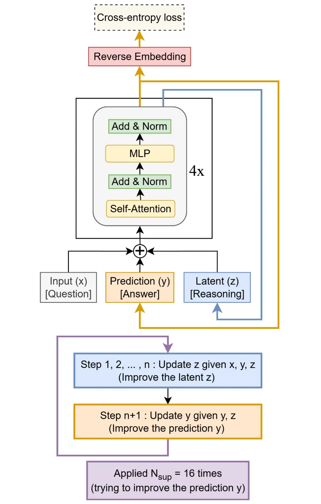
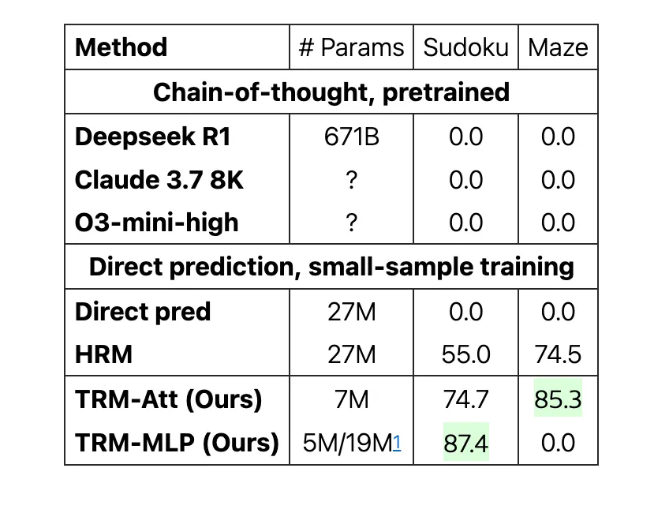

# TRM Implementation Article:-

---

If you were a traditional LLM, this is how you would solve a sudoku puzzle:-

1. Glance at the clues once
2. Think super hard
3. Solve the entire puzzle in one go

As a human, this sounds unnatural and impossible. There is a chance that you "will" solve the puzzle with this method, but building "problem solving" systems isn't about "betting on one in a hundred chances", but decisively move with the task at hand.

How, as a human would we solve a sudoku puzzle:-

1. We read the puzzle
2. Think, fill random values
3. Verify, reconsider, correct it
4. Iterate until reached the answer

This feels more natural, and this is is the system that's native to "Tiny Recursive Models" in the paper "Less is More" with ~7M parameters.

This method aced 87% accuracy on sudoku puzzles, with 100,000x times larger(parameter-wise) models were way behind using the "think hard once and answer the entire thing" method.

For years, "scaling is power" philosophy was leading the revolution, and it did push the frontiers ahead, but there were obvious moments where scaling hit the wall. Scaling does matter, but when it comes to reasoning capabilities(replicating human), architecture matters more than the number of parameters added.

Takeaway -> "increasing the size of you brain" vs "learning how to use your current brain".

Benefits of architecture-tweaking(TRM in this instance):-

1. Run efficient reasoning models in consumer hardware(laptop/phone), it means no enterprise GPUs for each and everything.
2. Reduce -> a) training cost b) training time from weeks -> hours.
3. Better reasoning capabilities overall

---

TRM tracks three elements at its core:-

1. x (the question) -> It remains constant, but is referred by the other two elements again and again to "test" the current iterated output.
2. y (the current prediction/answer/output) -> it starts random and keeps getting refined and tested.
3. z (the reasoning/scratchpad) -> this is where the model "thinks" how to predict the next "y" based upon the previous "y".

These three interact with each other through transformer layers.

***TRM architecture:-***

***Benchmark results:-***

